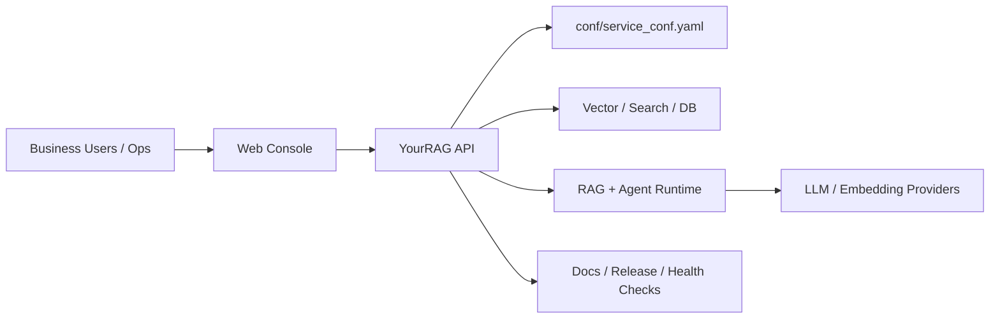

# YourRAG - 企业级私有检索增强平台 | Enterprise Private RAG Platform

[](https://github.com/however-yir/yourrag/actions/workflows/tests.yml)
[](https://github.com/however-yir/yourrag/tree/main/docs)
[](./LICENSE)
[](https://github.com/however-yir/yourrag)

> Status: `active`
>
> Upstream: `infiniflow/ragflow`

> **非官方声明（Non-Affiliation）**  
> 本仓库为社区维护的衍生/二次开发版本，与上游项目及其权利主体不存在官方关联、授权背书或从属关系。  
> **商标声明（Trademark Notice）**  
> 相关项目名称、Logo 与商标归其各自权利人所有。本仓库仅用于说明兼容/来源，不主张任何商标权利。
>
> Series: [local-ai-hub](https://github.com/however-yir/local-ai-hub) · [LZKB](https://github.com/however-yir/LZKB)

> **非官方声明（Non-Affiliation）**<br>
> `YourRAG` 是基于 `infiniflow/ragflow` 的社区维护衍生版，与上游项目及其权利主体不存在官方关联、授权背书或从属关系。<br>
> **商标声明（Trademark Notice）**<br>
> `RAGFlow` 及相关项目名称、Logo 与商标归其各自权利人所有；本仓库仅用于说明上游来源与兼容关系。


YourRAG 是一个基于 RAGFlow 深度改造的私有化 RAG + Agent 平台，目标是用于你的自有品牌交付与可持续二开。

## 项目快照

- 定位：企业交付导向的私有 RAG + Agent 平台。
- 亮点：RAGFlow 深度改造、部署形态完整、默认安全收敛、CI 通用化。
- 最短运行路径：`cd docker && cp .env.example .env.local && docker compose --env-file .env.local -f docker-compose.yml up -d`
- 系列分工：`YourRAG` 面向企业 RAG/Agent 交付，`LZKB` 面向知识平台，`Local AI Hub` 面向本地工作台。

## AI 平台分工矩阵

| Repo | 主要角色 | 部署形态 | 最适合的场景 |
| --- | --- | --- | --- |
| `Local AI Hub` | 本地 AI 工作台 | 自托管工作台 | 模型接入、团队日用、统一入口 |
| `LZKB` | 知识库平台 | 本地优先平台 | 文档入库、知识运营、检索问答 |
| `YourRAG` | 企业 RAG/Agent 平台 | 企业交付导向 | 私有化部署、RAG + Agent 交付 |

## 核心定位

- 自有品牌：项目名、默认账号、镜像、配置入口已迁移到 `YourRAG`。
- 安全优先：默认配置去敏，私钥不再提交到仓库。
- 可运维：补齐单机、Docker Compose、Kubernetes 三套部署文档。
- 可演进：保留对上游部分兼容能力，便于后续同步与迁移。

## 已完成改造

- Go 模块从 `ragflow` 迁移为 `yourrag`，内部导入路径同步更新。
- 默认管理员改为 `admin@yourrag.local`，默认口令改为 `change_me_please`。
- `service_conf` 顶层服务键从 `ragflow` 改为 `yourrag`，并保留旧键兼容读取。
- Token 前缀改为 `yourrag-`，同时保留 `ragflow-` 兼容解析。
- 私钥/公钥从仓库移除并加入忽略规则；新增一键生成脚本。
- 前端与 CLI 登录加密改为 `RSA 可选 + base64 回退`，避免强依赖仓库内密钥。
- CI 重构为 GitHub Hosted Runner 的通用流水线。

## 企业级加固（Enterprise Hardening）

已完成 50 项企业级完善，覆盖安全、可观测性、存储、CI/CD、架构五大维度：

### 安全加固
- CORS 白名单：通过 `CORS_ALLOWED_ORIGINS` 环境变量配置，生产环境必须收紧
- 默认密码守卫：启动时检测 `change_me_*` 系列密码，拒绝不安全启动
- SECRET_KEY 轮换：支持 `RAGFLOW_PREVIOUS_SECRET_KEY` 实现零停机密钥轮换
- Pickle 反序列化修复：移除 numpy 安全白名单，优先使用 JSON 序列化
- ES TLS 可配置：通过 `ES_TLS_ENABLED` 环境变量控制
- 双层限流：Nginx + 应用层令牌桶限流，可配置 RPS/窗口/突发
- 请求体硬上限：10 GiB 绝对上限，防止 OOM
- 审计日志：所有写操作记录 who/what/when/ip

### 可观测性
- Prometheus `/v1/system/metrics` 端点：请求延迟、内存、CPU、文件描述符
- Grafana 仪表盘：预置 `grafana/yourrag-dashboard.json`
- OpenTelemetry 全栈：`docker/docker-compose.otel.yml` 部署 Collector + Prometheus + Grafana

### 存储与运维
- Redis AOF 持久化：appendonly + everysec fsync
- ES ILM 策略：hot(7d) → warm(30d) → cold(90d) → delete(365d)
- 自动备份脚本：`tools/scripts/backup.sh`（MySQL + MinIO + S3）
- 冷数据归档：`tools/scripts/cold_archive.sh`

### CI/CD
- Codecov：项目覆盖率目标 60%，补丁覆盖率目标 50%
- Go 检查扩展：go vet + handler/service 测试
- 前端检查：TypeScript 类型检查 + ESLint
- 多架构构建：Docker 支持 amd64 + arm64
- SBOM 生成：Syft + Trivy 供应链安全
- Dependabot：npm 生态 + 安全分组

### 架构优化
- LLM 响应缓存：Redis 后端，SHA256 缓存键，可配置 TTL
- 配置热重载：`CONFIG_HOT_RELOAD=1` 监听 service_conf.yaml 变更
- Nginx 增强：限流区域、WebSocket 升级、连接池优化

完整清单见：`docs/customization/completed-checklist.md`

## 部署文档

- 单机部署：`docs/deployment/single-host.md`
- Docker Compose：`docs/deployment/docker-compose.md`
- Kubernetes/Helm：`docs/deployment/kubernetes.md`

## 企业部署拓扑



## 快速启动（Docker Compose）

```bash
cd docker
cp .env.example .env.local
# 修改密码与管理员账号后启动

docker compose --env-file .env.local -f docker-compose.yml up -d
curl -f http://127.0.0.1:9380/v1/system/ping
```

轻量开发档位（更低资源占用）：

```bash
cd docker
cp .env.local.lite.example .env.local.lite
docker compose --env-file .env.local.lite -f docker-compose.yml up -d
```

## 评测与观测路径

| 层面 | 入口 | 用途 |
| --- | --- | --- |
| 健康探针 | `curl /v1/system/ping` | 启动后最小可用性检查 |
| 快速上手 | `docs/quickstart.mdx` | 新成员最短上手路径 |
| 部署说明 | `docs/deployment/*` | 单机、Compose、K8s 三套部署面 |
| 发布记录 | `docs/release_notes.md` | 版本变化与交付说明 |
| Helm 部署 | `helm/README.md` | 企业 K8s 安装入口 |
| 配置基线 | `conf/service_conf.yaml` | 服务级默认配置 |
| 密钥准备 | `tools/scripts/generate_rsa_keys.sh` | 私钥/公钥初始化 |

## RSA 密钥（可选）

```bash
./tools/scripts/generate_rsa_keys.sh
```

如未配置 RSA 密钥，系统会回退为 base64 传输模式以保证可用性。

## 与上游关系

- 本项目基于上游 RAGFlow 进行二次开发。
- 继续遵循 Apache-2.0（见 `LICENSE`）。
- 归属与附加说明见 `NOTICE` 与 `LICENSE-ADDITIONAL.md`。
## Engineering Quality

This repository includes a contract-based quality baseline to keep essential engineering standards stable over time.

- Quality plan: [docs/ENGINEERING_QUALITY.md](docs/ENGINEERING_QUALITY.md)
- Contract tests: [tests/repo_contract_test.sh](tests/repo_contract_test.sh)
- Contract CI workflow: [.github/workflows/repo-contract-ci.yml](.github/workflows/repo-contract-ci.yml)

Run local contract checks:

```bash
bash tests/repo_contract_test.sh
```
