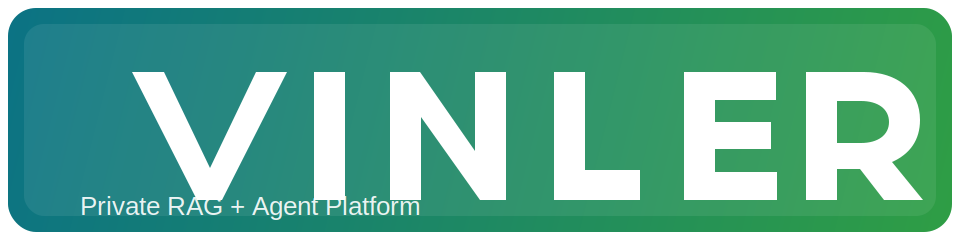

# YourRAG



YourRAG 是一个基于 RAGFlow 深度改造的私有化 RAG + Agent 平台，目标是用于你的自有品牌交付与可持续二开。

## 核心定位

- 自有品牌：项目名、默认账号、镜像、配置入口已迁移到 `YourRAG`。
- 安全优先：默认配置去敏，私钥不再提交到仓库。
- 可运维：补齐单机、Docker Compose、Kubernetes 三套部署文档。
- 可演进：保留对上游部分兼容能力，便于后续同步与迁移。

## 已完成改造

- Go 模块从 `ragflow` 迁移为 `yourrag`，内部导入路径同步更新。
- 默认管理员改为 `admin@yourrag.local`，默认口令改为 `change_me_please`。
- `service_conf` 顶层服务键从 `ragflow` 改为 `yourrag`，并保留旧键兼容读取。
- Token 前缀改为 `yourrag-`，同时保留 `ragflow-` 兼容解析。
- 私钥/公钥从仓库移除并加入忽略规则；新增一键生成脚本。
- 前端与 CLI 登录加密改为 `RSA 可选 + base64 回退`，避免强依赖仓库内密钥。
- CI 重构为 GitHub Hosted Runner 的通用流水线。

完整清单见：`docs/customization/completed-checklist.md`

## 部署文档

- 单机部署：`docs/deployment/single-host.md`
- Docker Compose：`docs/deployment/docker-compose.md`
- Kubernetes/Helm：`docs/deployment/kubernetes.md`

## 快速启动（Docker Compose）

```bash
cd docker
cp .env .env.local
# 修改密码与管理员账号后启动

docker compose --env-file .env.local -f docker-compose.yml up -d
curl -f http://127.0.0.1:9380/v1/system/ping
```

## RSA 密钥（可选）

```bash
./tools/scripts/generate_rsa_keys.sh
```

如未配置 RSA 密钥，系统会回退为 base64 传输模式以保证可用性。

## 与上游关系

- 本项目基于上游 RAGFlow 进行二次开发。
- 继续遵循 Apache-2.0（见 `LICENSE`）。
- 归属与附加说明见 `NOTICE` 与 `LICENSE-ADDITIONAL.md`。
